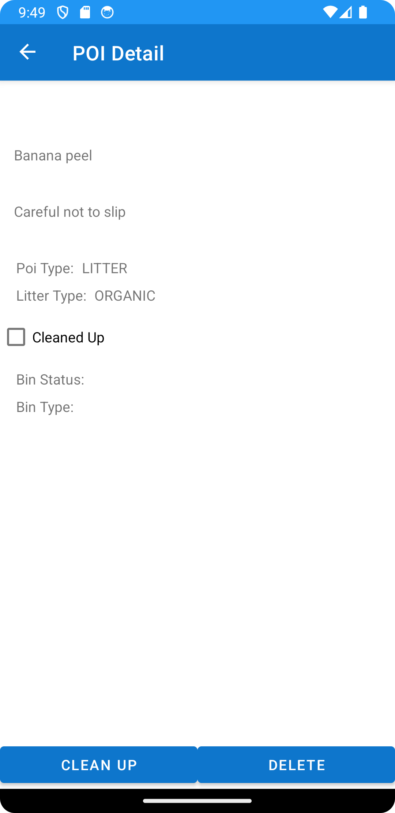

# BinThere
BinThere is an application designed to tackle environmental cleanliness through community engagement.
Its primary goal is to identify and manage litter hotspots by leveraging user-contributed data.
Users can add points of interest for litter they encounter, complete with photos, descriptions, and precise locations.
Additionally, the app aims to incorporate public bin locations, allowing users to not only
locate the nearest bins but also report overflowing ones and suggest new bin locations.

## Technologies used
- Git/GitHub
- Android Studio
- Kotlin
- Firebase Realtime Database
- Firebase Storage
- Firebase Authentication
- Picasso

## Functionality
### Signup/Login
Existing users can login to the app to view or add new point of interest.
New users can create accounts by providing email and password.
Firebase Authentication with email/password is used in the backend.

### Navigation bar
Navigation bar provides an easy way of switching activities and to sign out of the app.

### Bins and litter list
This view lists all the Bins and Litter to the user.
The user may swipe left to delete an entry or tap to see the detail view.

### Add Bin/Litter (POI)
This view allows the user to create a new POI, either a Bin or Litter point.
They can upload a relevant photo after taking it with the camera app.

### View Bin/Litter - Cleanup action
User can view the details for an individual POI and either delete it or select the Clean up action,
to mark the litter as cleaned up.

### About View
This view provides the vision behind the app.

### Firebase backend
Firebase Realtime Database was used to store the points of interest data.
POI Images are kept in Firebase Storage.

## UX/DX Approach Adopted
### DX
For the DX I chose to change the application to MVVM design pattern compared to the first version.
I intended to keep the naming convention clear and generic enough at the same time, for example to
keep the model easily expandable. The POIModel represents both Bins and Litter in the application.
Perhaps it would be better to split them into two separate classes, ideally Bins and Litters should
be subclasses of the POI class, but implementing it this way turned out to be quite complex, so just
a single class with a mix of fields was used.

### UX
The application was meant to be simple in terms of the interface and focused around a map view.
Unfortunately the map is missing in this version of the application. For this reason the most 
important activity is the POI List. The app doesn't offer much in terms of the UX at this stage.

## Git approach
I have used feature branches to develop new functionalities which were more of milestones.
Then opening pull requests and merging into the main branch. Small fixes or improvements were
sometimes worked on directly on the main branch.
I used tags and releases to mark important versions of the application.

## Personal Statement
For the second assignment, I chose to work on the same project/repository and expand
on the application built so far. As the initial approach I was trying to refactor the app from MVP
to MVVM design pattern component by component while keeping the application functional in between
the changes. This turned out to be quite challenging and after much delay I decided to go back and
start with a bare minimum MVVM skeleton and reintroduce the features from the previous version
of the application. In the end the MVVM pattern seems to be more convenient for the development.
However, refactoring the application was quite costly and I could definitely do it more efficiently
next time around.
In general I found the project enjoyable but quite challenging. There is a lot of scaffolding
required for each feature that is implemented, which takes the focus from the functionality that
the user is exposed to. This definitely got me to appreciate more all the good mobile apps
out there.
As for the future I think that a big takeaway for me is to make decisions quicker, to try out things
sooner which would allow to change the approach in a more informed way after the initial trial.
This would help with the dilemma of: stick to MVP, refactor to MVVM or start fresh MVVM.

## References
- Mobile Application Development labs and lectures (HDip)
- [timberkt - Kotlin logging extensions for Timber](https://github.com/ajalt/timberkt)
- [Medium: Ian Lake - Layouts, Attributes, and you](https://medium.com/androiddevelopers/layouts-attributes-and-you-9e5a4b4fe32c)
- [Data Classes in Kotlin](https://antonioleiva.com/data-classes-kotlin/)
- [developer.android.com - Create dynamic lists with RecyclerView](https://developer.android.com/develop/ui/views/layout/recyclerview)
- [developer.android.com - Set up the app bar](https://developer.android.com/develop/ui/views/components/appbar/setting-up)
- [Kotlin - Parcelize - Parcelable implementation generator](https://developer.android.com/kotlin/parcelize)
- [developer.android.com - Storage Access Framework](https://developer.android.com/guide/topics/providers/document-provider)
- [developer.android.com - Splash screen](https://developer.android.com/develop/ui/views/launch/splash-screen)

### Samples
- [MapsActivityCurrentPlace](https://github.com/googlemaps-samples/android-samples/blob/main/tutorials/kotlin/CurrentPlaceDetailsOnMap/app/src/main/java/com/example/currentplacedetailsonmap/MapsActivityCurrentPlace.kt)
- [MyLocationDemoActivity](https://github.com/googlemaps-samples/android-samples/blob/main/ApiDemos/java/app/src/gms/java/com/example/mapdemo/MyLocationDemoActivity.java)